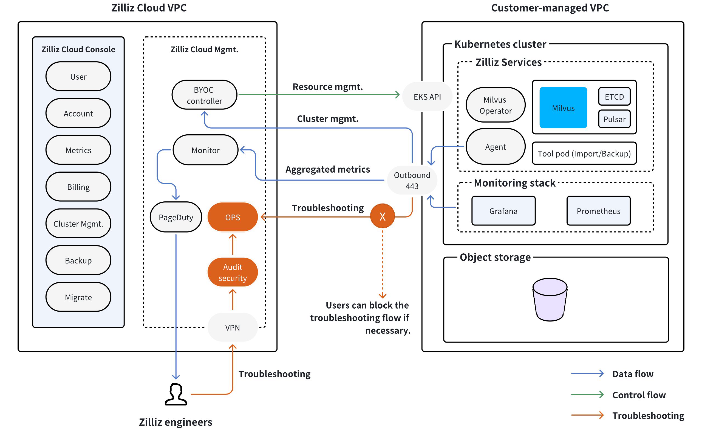

# Zilliz Cloud BYOC Project Setup Guide (Bootstrap Provider)

This guide explains how to configure a Bring-Your-Own-Cloud (BYOC) environment using the `zillizcloud_byoc_project` Terraform resource. You'll deploy a fully managed Milvus cluster within your AWS infrastructure while maintaining complete control over your data and network environment.

## Table of Contents
- [Key Concepts](#key-concepts)
- [Prerequisites](#prerequisites)
- [Quick Start](#quick-start)
- [Architecture Overview](#architecture-overview)
- [Resource Configuration Deep Dive](#resource-configuration-deep-dive)
  - [Dependencies Breakdown](#dependencies-breakdown)
    - [VPC Module](#vpc-module)
    - [S3 Storage Module](#s3-storage-module)
    - [IAM Roles Module](#iam-roles-module)
  - [BYOC Project Configuration](#byoc-project-configuration)

## Key Concepts <a name="key-concepts"></a>

### What is BYOC?
Zilliz Cloud BYOC enables you to:
- Maintain data sovereignty with storage in your AWS account
- Deploy Milvus clusters in your private VPC
- Leverage Zilliz's managed service while controlling infrastructure
- Comply with enterprise security requirements


## Prerequisites <a name="prerequisites"></a>

- **AWS Requirements**
  - AWS account with admin privileges
  - AWS CLI configured with credentials
  - Target region enabled in your AWS account

- **Zilliz Cloud Requirements**
  - Active Zilliz Cloud account
  - API credentials with project creation permissions

- **Tooling**
  - Terraform v1.0+

## Quick Start <a name="quick-start"></a>

### 1. Clone Reference Architecture
```bash
git clone https://github.com/zilliztech/terraform-zilliz-examples.git
cd examples/aws-project-byoc-standard
```

### 2. Configure Environment
`terraform.tfvars.json`
```json
{
  "name": "prod-milvus-cluster",
  "aws_region": "us-west-2",
  "vpc_cidr": "10.1.0.0/16",
  "core_instance_type": "m6i.2xlarge",
  "fundamental_instance_type": "m6i.4xlarge",
  "search_instance_type": "g4dn.2xlarge",
  "enable_private_link": true
}
```

### 3. Deploy Infrastructure
```bash
terraform init
terraform apply
```

## Architecture Overview <a name="architecture-overview"></a>





## Resource Configuration Deep Dive <a name="resource-configuration-deep-dive"></a>


## Dependencies Breakdown <a name="dependencies-breakdown"></a>

zillizcloud_byoc_project depends on the following modules:

### 1. VPC Module
```hcl
module "aws_vpc" {
  source = "../../modules/aws_vpc"
  
  aws_region = var.aws_region
  vpc_cidr   = var.vpc_cidr
  name       = var.name
  enable_private_link = var.enable_private_link
}
```

Creates:
- VPC with specified CIDR range
- NAT Gateway for outbound connectivity
- Route tables for subnet routing
- VPC Endpoint (when private link enabled)

### 2. S3 Storage Module
```hcl
module "aws_bucket" {
  source = "../../modules/aws_bucket"
  
  aws_region      = var.aws_region
  name            = var.name
  s3_bucket_names = ["milvus"]
}
```

Features:
- Server-side encryption (SSE-S3/SSE-KMS)
- Versioning enabled by default
- Lifecycle policies for data rotation
- Access restricted to Zilliz roles

### 3. IAM Roles Module
```hcl
module "aws_iam" {
  source = "../../modules/aws_iam"
  
  bucketName = module.aws_bucket.s3_bucket_ids
  name       = var.name
  ExternalId = data.zillizcloud_external_id.current.id
}
```

Manages:
- Role trust policies with Zilliz Cloud
- Fine-grained permissions boundaries
- Instance profile for EKS nodes
- S3 bucket access policies


## BYOC Project Configuration
```hcl
resource "zillizcloud_byoc_project" "production" {
  name = "milvus-production"

  aws = {
    region = "aws-${var.aws_region}"
    
    network = { /* ... */ }
    role_arn = { /* ... */ }
    storage = { /* ... */ }
    instances = { /* ... */ }
  }
}
```

### 1. Network Configuration
```hcl
network = {
  vpc_id             = module.aws_vpc.vpc_id
  subnet_ids         = module.aws_vpc.private_subnets
  security_group_ids = [module.aws_vpc.security_group_id]
  vpc_endpoint_id    = var.enable_private_link ? module.aws_vpc.endpoint_id : null
}
```

| Parameter | Description |
|-----------|-------------|
| `vpc_id` | reference to the vpc id created in the vpc module |
| `subnet_ids` | reference to the private subnets created in the vpc module | 
| `security_group_ids` | reference to the security group created in the vpc module |
| `vpc_endpoint_id` | reference to the vpc endpoint id created in the vpc module |  

### 2. IAM Roles Configuration
```hcl
role_arn = {
  storage       = module.aws_iam.storage_role_arn
  eks           = module.aws_iam.eks_role_arn
  cross_account = module.aws_iam.cross_account_role_arn
}
```

| Role              | Purpose                                                                     |
|-------------------|-----------------------------------------------------------------------------|
| `storage`         | reference to the storage role created in the previous step                  |
| `eks`             | reference to the eks role created in the previous step                      |
| `cross_account`   | reference to the cross-account role created in the previous step             |

### 3. Instance Configuration
```hcl
instances = {
  core_vm        = "m6i.2xlarge"
  fundamental_vm = "r5.4xlarge" 
  search_vm      = "g4dn.4xlarge"
}
```

| Instance Type      | Recommended Type   | Purpose                                      |
|--------------------|--------------------|----------------------------------------------|
search_vm | m6id.4xlarge | Instances solely used for query services
fundamental_vm | m6i.2xlarge | Instances used for fundamental database components, which are mainly used as the index pool
core_vm | m6i.2xlarge |  Instances used for peripheral support services, including Milvus Operator, Zilliz Cloud Agent, and Milvus dependencies for logging, monitoring, and alerting


